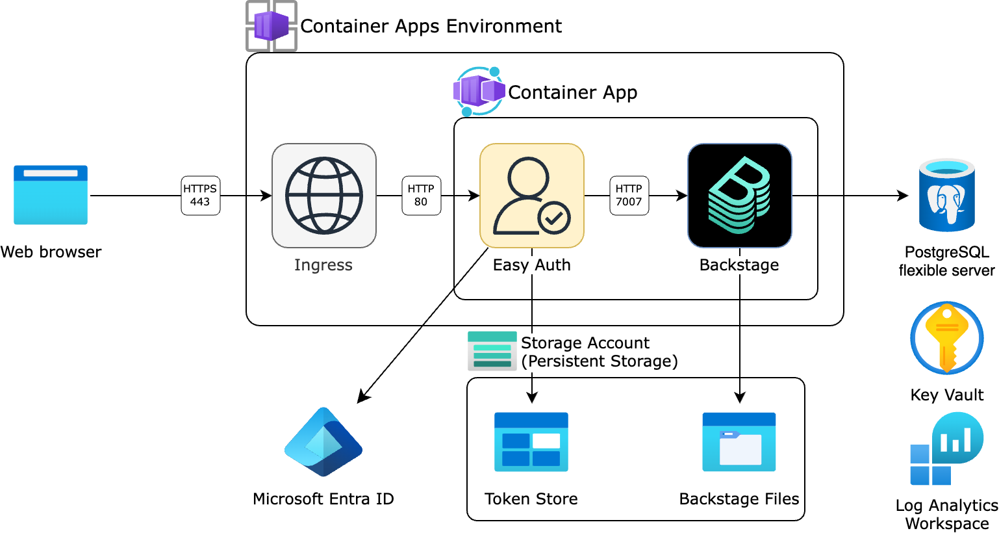

# Architecture

## Overview

## Container specs

The locations of config / static catalog files in the container:

|Path in container|Source|
|-|-|
|`/config`|Dockerfile|
|`/catalogs`|Dockerfile|
|`/data/config`|Azure Files|
|`/data/catalogs`|Azure Files|

The `/entrypoint.sh` script gets the Backstage app to load the configuration files in the following order:

- `/config/app-config.yaml`
- `/config/app-config.*.yaml`
- `/data/config/app-config.*.yaml` (in persistent volume)

The environment variables `APP_CONFIG_*` can be used to override these configurations.
They are defined in the following locations:

- `compose.yml` and `docker.env` for the local development
- `infra/app/app.bicep` for Azure Container Apps
